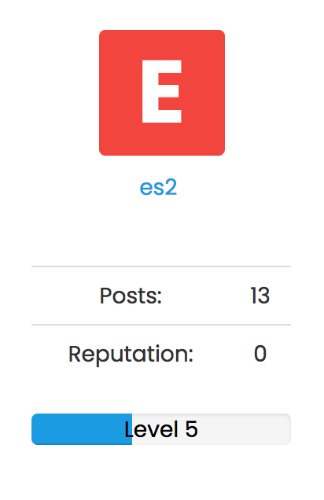

## Installation

    npm install nodebb-plugin-gamification

## Template language
### topic/post.tpl
     <!-- IF posts.lvl -->
        <!-- IMPORT partials/topic/level.tpl -->
     <!-- ENDIF posts.lvl --> 
### profile.tpl
    <!-- IF lvl -->
        

            
{lvl}

               Level
        

    <!-- ENDIF lvl -->

## Screenshots

Don't forget to add screenshots!

